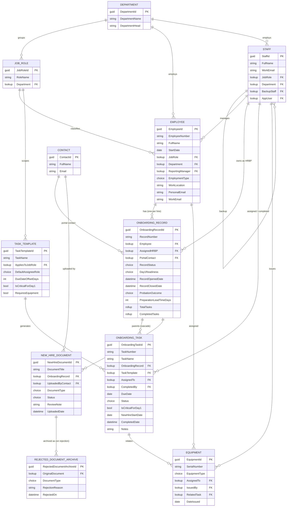

# 6. Entity Relationship Diagram

The data model consists of ten custom tables — four reference tables, four core transactional tables, one supporting transactional table for documents, and one audit table for rejected documents — plus the standard **Contact** table, which serves as the portal identity for new hires.

> **Phase note.** This ERD reflects the model **as built across both parts of Phase 2.** The Rejected Document Archive table, the Contact relationships, and the portal-related columns on New Hire Document and Onboarding Record were added in **Phase 2 Part 2** (the Power Pages portal — Sections 17–20). Everything else was built in Part 1.

---

> The Staff → Onboarding Task line covers two lookups (Assigned To and Completed By), shown as one relationship for readability; both appear as FKs on Onboarding Task. Parental relationships (Onboarding Record → Task and → Document) cascade on delete; all other lookups use Remove Link or Restrict per the as-built model. **Contact** is the standard Dataverse table that serves as the new hire's portal identity (see Section 17); only the columns relevant to this model are shown.
---

## Tables

### Department (reference)

| Column | Type | Notes |
| --- | --- | --- |
| Department Name | Single Line of Text | Primary Name |
| Department Code | Auto Number (DEP-001) | Unique |
| Department Head | Single Line of Text | |

### Job Role (reference)

| Column | Type | Notes |
| --- | --- | --- |
| Role Name | Single Line of Text | Primary Name |
| Role Code | Auto Number (JR-001) | Unique |
| Department | Lookup → Department | |
| Is Customer Facing | Yes/No | |

### Staff (reference)

| Column | Type | Notes |
| --- | --- | --- |
| Full Name | Single Line of Text | Primary Name |
| Staff Number | Auto Number (STF-001) | Unique (Alternate Key) |
| Staff Role | Choice | HRBP, Head of HR, IT Admin, Facilities Officer, Compliance Officer, Manager |
| Department | Lookup → Department | |
| Email | Email | |
| Backup Staff | Lookup → Staff | Self-reference |
| App User | Lookup → User | Stores the system-user identity for flow ownership (see Section 12) |

### Task Template (reference)

| Column | Type | Notes |
| --- | --- | --- |
| Task Name | Single Line of Text | Primary Name |
| Template Code | Auto Number (TPL-001) | |
| Default Assignee Role | Choice | |
| Due Date Offset Days | Whole Number | Days relative to Start Date (negative = before) |
| Is Critical For Day 1 | Yes/No | |
| Applies To Job Role | Lookup → Job Role | Blank = all roles |
| Requires Equipment | Yes/No | |

### Employee (transactional)

| Column | Type | Notes |
| --- | --- | --- |
| Full Name | Single Line of Text | Primary Name |
| Employee Number | Auto Number (EMP-001) | Unique (Alternate Key) |
| Job Role | Lookup → Job Role | |
| Department | Lookup → Department | |
| Start Date | Date Only | |
| Reporting Manager | Lookup → Staff | |
| Employment Type | Choice | Full-time, Contract, Part-time |
| Work Location | Single Line of Text | |
| Personal Email | Email | |
| Work Email | Email | Populated by IT |

### Onboarding Record (transactional)

| Column | Type | Notes |
| --- | --- | --- |
| Record Number | Auto Number (REC-001) | Primary Name |
| Employee | Lookup → Employee | Unique (1:1) |
| Record Status | Choice | Not Started, In Progress, At Risk, Completed |
| Record Opened Date | Date and Time | |
| Record Closed Date | Date and Time | |
| Assigned HRBP | Lookup → Staff | |
| Portal Contact | Lookup → Contact | The new hire's portal identity (see Section 17) |
| Day-1 Readiness | Choice | Pending, Ready, At Risk |
| Probation Outcome | Choice | Passed, Extended, Failed |

### Onboarding Task (transactional)

| Column | Type | Notes |
| --- | --- | --- |
| Task Number | Auto Number (TSK-001) | Primary Name |
| Onboarding Record | Lookup → Onboarding Record | Parental |
| Task Name | Single Line of Text | |
| Assigned To | Lookup → Staff | |
| Due Date | Date Only | |
| Status | Choice | Not Started, In Progress, Completed |
| Completed Date | Date and Time | |
| Completed By | Lookup → Staff | |
| Is Critical For Day 1 | Yes/No | |
| New Hire Start Date | Date Only | Stamped at generation |
| Notes | Multi-line Text | |
| Template | Lookup → Task Template | |

### Equipment (transactional)

| Column | Type | Notes |
| --- | --- | --- |
| Serial Number | Single Line of Text | Primary Name (Unique) |
| Equipment Type | Choice | Laptop, Monitor, Headset, Phone, Access Card, Other |
| Assigned To | Lookup → Employee | |
| Date Issued | Date Only | |
| Issued By | Lookup → Staff | |
| Related Task | Lookup → Onboarding Task | |

### New Hire Document (transactional)

| Column | Type | Notes |
| --- | --- | --- |
| Document Title | Calculated | Employee Full Name + " — " + Document Type |
| Onboarding Record | Lookup → Onboarding Record | Parental |
| Uploaded By Contact | Lookup → Contact | The portal contact who uploaded the document (drives row-level isolation — see Section 19) |
| Document Type | Choice | Passport Photo, NIN Slip, BVN Slip, Academic Certificate, Bank Details, Other |
| File Attachment | File / Note | Stored as a Note attachment for the portal upload control |
| Status | Choice | Pending Review, Approved, Rejected |
| Review Note | Multi-line Text | HR's feedback, shown to the hire on rejection (`pex_rejectionreason`) |
| Uploaded Date | Date and Time | |

### Rejected Document Archive (transactional / audit)

Added in Phase 2 Part 2. When a document is rejected, an archive row preserves the rejected file and its context before the upload slot is freed for resubmission, so a tamper-evident history of rejected submissions is retained (see Section 18).

| Column | Type | Notes |
| --- | --- | --- |
| Original Document | Lookup → New Hire Document | The document this archive row was created from (`pex_originaldocument`) |
| Document Type | Choice | Carried from the original document |
| Rejection Reason | Multi-line Text | The Review Note at the time of rejection |
| Rejected On | Date and Time | When the rejection occurred |

---

## Relationships

| Parent | Child | Cardinality | Behaviour |
| --- | --- | --- | --- |
| Department | Job Role | 1:N | Referential, Restrict Delete |
| Department | Employee | 1:N | Referential, Restrict Delete |
| Department | Staff | 1:N | Referential, Restrict Delete |
| Job Role | Employee | 1:N | Referential, Restrict Delete |
| Job Role | Task Template | 1:N | Referential, Remove Link |
| Staff | Employee (Manager) | 1:N | Referential |
| Staff | Onboarding Record (HRBP) | 1:N | Referential |
| Staff | Onboarding Task (Assignee) | 1:N | Referential |
| Staff | Onboarding Task (Completed By) | 1:N | Referential |
| Staff | Equipment (Issued By) | 1:N | Referential |
| Staff | Staff (Backup) | 1:1 | Referential, self-reference |
| Employee | Onboarding Record | 1:1 | Referential, unique constraint |
| Employee | Equipment | 1:N | Referential, Restrict Delete |
| Onboarding Record | Onboarding Task | 1:N | Parental |
| Onboarding Record | New Hire Document | 1:N | Parental |
| Task Template | Onboarding Task | 1:N | Referential, Remove Link |
| Onboarding Task | Equipment | 1:0..1 | Referential |
| **Contact** | **Onboarding Record (Portal Contact)** | **1:N** | **Referential — the portal identity that owns the record** |
| **Contact** | **New Hire Document (Uploaded By Contact)** | **1:N** | **Referential — the portal identity that uploaded the document** |
| **New Hire Document** | **Rejected Document Archive (Original Document)** | **1:N** | **Referential, Remove Link — archive survives if the original is later removed** |

---

➡️ Next: **[Section 7 — Business Logic](../07-Business-Logic)**
