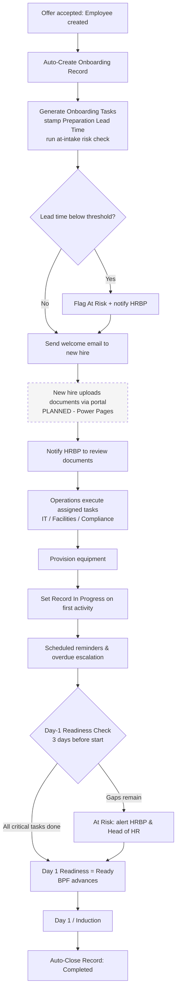

# 9. Process Flow Diagram

The end-to-end onboarding process from offer signing through 90-day probation closure, shown as a BPMN-style swim-lane diagram organised by role.

---

> Reflects the implemented (as-built) process. The document-upload step via the Power Pages portal is shown dashed because that component is planned, not yet built — see Sections 10 and 16.
---

## Reading the Diagram

The flow runs left to right across five swim lanes, one per role:

| Lane | Role | What they do |
| --- | --- | --- |
| 1 | New Hire | Signs offer, uploads documents, starts Day 1 |
| 2 | HR Business Partner | Submits the New Hire Form, reviews documents, addresses readiness gaps |
| 3 | System (Power Platform) | Validates, creates the record, generates and assigns tasks, runs readiness checks, auto-closes |
| 4 | Operations (IT, Facilities, Compliance) | Executes assigned tasks in parallel |
| 5 | Reporting Manager | Onboarding Progress check-in |

---

## Key Decision Points

The process has three decision gates where the flow can branch:

**1. Form Validation** — If the New Hire Form fails validation, the HRBP is shown errors and returned to the form to correct.

**2. Day-1 Readiness Check** — Three days before Start Date, the system evaluates whether all critical tasks are complete. If At Risk, the HRBP must address outstanding gaps before the check re-runs.

**3. Probation Outcome** — At Day 90, the Reporting Manager records the outcome. Passed closes the record. Extended loops back into further probation check-ins. Failed exits the process through an HR offboarding path.

---

## Parallel Execution

After task generation, three streams run concurrently rather than sequentially:

- Operations executes IT, Facilities, and Compliance tasks
- The new hire uploads personal documents via the self-service portal
- The HRBP reviews and approves those documents as they arrive

All three streams must complete before the Day-1 Readiness Check can return Ready.

---

## End of Phase 1 — Crossing into the Build

Sections 1–9 complete the **design and specification** of the Employee Onboarding Tracker: the problem, the people, the requirements, the data model, the business rules, the chosen components, and the end-to-end process. With the design settled, the project moves into **Phase 2 — Build & Delivery**, where the specification becomes a working solution on the Power Platform.

Phase 2 begins by building the first of the planned Power Platform components: the **Dataverse data model**, the **model-driven app** (the primary interface for HR and operational staff), and the **Power Automate** automation that drives the process. It then covers the business process flow, the security model, an operational metric, and the solution-hygiene and export work that makes the solution deployable. Remaining components specified here — most notably the Power Pages self-service portal — are planned for later phases.

Section 10 opens the build.

---

➡️ Next: **[Section 10 — Build Overview and Environment](../10-Build-Overview-and-Environment)**
