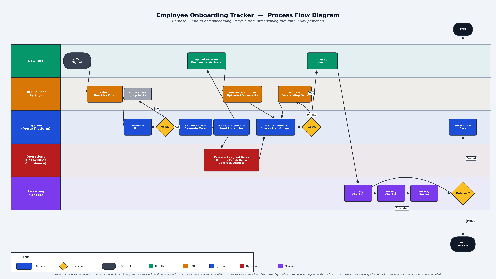

# 9. Process Flow Diagram

The end-to-end onboarding process from offer signing through 90-day probation closure, shown as a BPMN-style swim-lane diagram organised by role.

---

---

## Reading the Diagram

The flow runs left to right across five swim lanes, one per role:

| Lane | Role | What they do |
| --- | --- | --- |
| 1 | New Hire | Signs offer, uploads documents, starts Day 1 |
| 2 | HR Business Partner | Submits the New Hire Form, reviews documents, addresses readiness gaps |
| 3 | System (Power Platform) | Validates, creates the case, generates and assigns tasks, runs readiness checks, auto-closes |
| 4 | Operations (IT, Facilities, Compliance) | Executes assigned tasks in parallel |
| 5 | Reporting Manager | Conducts 30/60/90-day check-ins and records probation outcome |

---

## Key Decision Points

The process has three decision gates where the flow can branch:

**1. Form Validation** — If the New Hire Form fails validation, the HRBP is shown errors and returned to the form to correct.

**2. Day-1 Readiness Check** — Three days before Start Date, the system evaluates whether all critical tasks are complete. If At Risk, the HRBP must address outstanding gaps before the check re-runs.

**3. Probation Outcome** — At Day 90, the Reporting Manager records the outcome. Passed closes the case. Extended loops back into further probation check-ins. Failed exits the process through an HR offboarding path.

---

## Parallel Execution

After task generation, three streams run concurrently rather than sequentially:

- Operations executes IT, Facilities, and Compliance tasks
- The new hire uploads personal documents via the self-service portal
- The HRBP reviews and approves those documents as they arrive

All three streams must complete before the Day-1 Readiness Check can return Ready.

---

⬅️ Back to: **[Main README](../README.md)**
