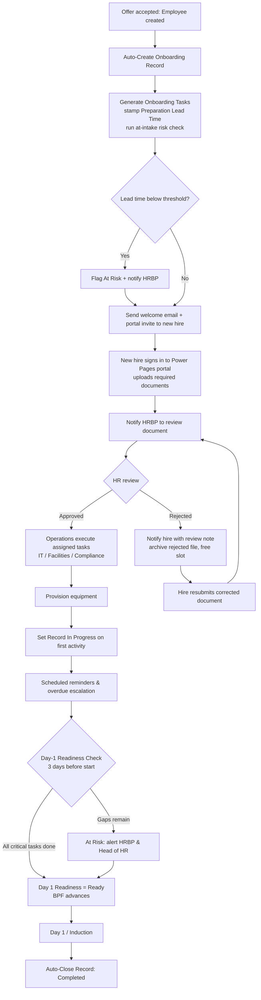

# 9. Process Flow Diagram

The end-to-end onboarding process from offer signing through 90-day probation closure, shown as a BPMN-style swim-lane diagram organised by role.

---

> Reflects the implemented (as-built) process across both parts of Phase 2 — including the Power Pages document upload, HR review, and rejection/resubmission cycle built in **Phase 2 Part 2** (see Sections 17–20).
---

## Reading the Diagram

The flow runs across five role lanes:

| Lane | Role | What they do |
| --- | --- | --- |
| 1 | New Hire | Signs offer, uploads documents via the portal, resubmits if rejected, starts Day 1 |
| 2 | HR Business Partner | Submits the New Hire Form, reviews and approves/rejects documents, addresses readiness gaps |
| 3 | System (Power Platform) | Validates, creates the record, generates and assigns tasks, notifies, archives rejected files, runs readiness checks, auto-closes |
| 4 | Operations (IT, Facilities, Compliance) | Executes assigned tasks in parallel |
| 5 | Reporting Manager | Onboarding progress check-in and probation outcome |

---

## Key Decision Points

The process has four decision gates where the flow can branch:

**1. Form Validation** — If the New Hire Form fails validation, the HRBP is shown errors and returned to the form to correct.

**2. HR Document Review** — Each uploaded document is reviewed by the HRBP. **Approved** documents proceed; **Rejected** documents trigger a notification to the new hire (with the review note), the rejected file is archived for audit and the upload slot is freed, and the hire resubmits a corrected document — which routes back into review. This loop continues until the document is approved.

**3. Day-1 Readiness Check** — Three days before Start Date, the system evaluates whether all critical tasks are complete. If At Risk, the HRBP must address outstanding gaps before the check re-runs.

**4. Probation Outcome** — At Day 90, the Reporting Manager records the outcome. Passed closes the record. Extended loops back into further probation check-ins. Failed exits the process through an HR offboarding path.

---

## Parallel Execution

After task generation, three streams run concurrently rather than sequentially:

- Operations executes IT, Facilities, and Compliance tasks
- The new hire uploads personal documents via the self-service portal
- The HRBP reviews and approves (or rejects) those documents as they arrive

All three streams must complete before the Day-1 Readiness Check can return Ready.

---

## End of Phase 1 — Crossing into the Build (Phase 2)

Sections 1–9 complete the **design and specification** of the Employee Onboarding Tracker: the problem, the people, the requirements, the data model, the business rules, the chosen components, and the end-to-end process. With the design settled, the project moves into **Phase 2 — Build & Delivery**, where the specification becomes a working solution on the Power Platform.

Phase 2 is delivered in two parts. **Part 1 (Sections 10–16)** builds the internal solution: the **Dataverse data model**, the **model-driven app** (the primary interface for HR and operational staff), and the **Power Automate** automation that drives the process — then the business process flow, the security model, an operational metric, and the solution-hygiene and export work that makes it deployable. **Part 2 (Sections 17–20)** builds the external-facing **Power Pages portal**: new-hire document upload, HR review, resubmission, notifications, row-level isolation, and duplicate prevention.

The two remaining specified components — **Power BI** dashboards and an optional **Copilot Studio** assistant — are planned for **Phase 3**.

Section 10 opens the build.

---

➡️ Next: **[Section 10 — Build Overview and Environment](../10-Build-Overview-and-Environment)**
