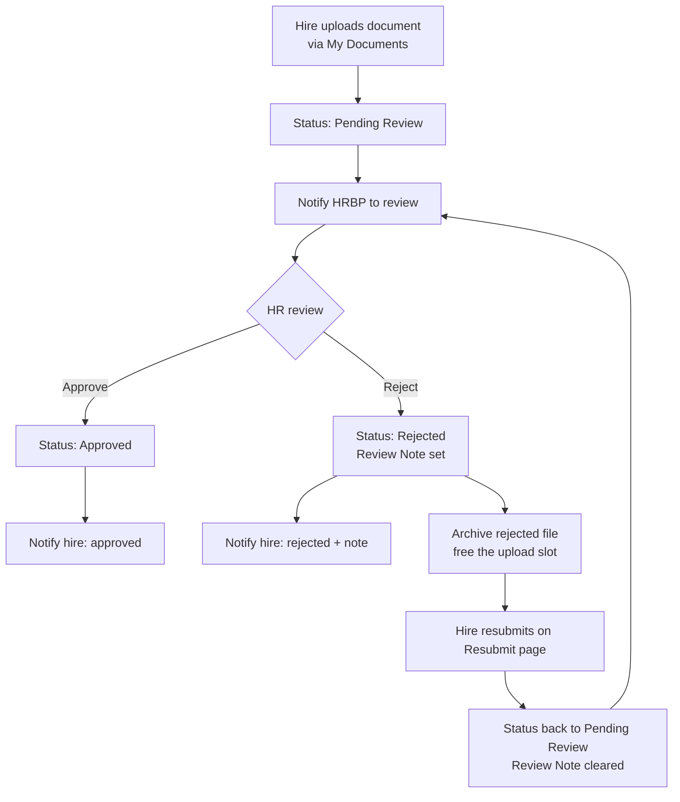

# 18. Document Lifecycle and Portal Automation

Section 17 described the portal's pages. This section describes what happens *behind* them — the automation that turns a new hire's document upload into a reviewed, approved-or-rejected, audited, and (where needed) resubmitted document, with the right people notified at each step.

Five Power Automate flows drive this lifecycle. They are the portal's half of the solution's 22 flows; the seventeen backend flows are in [Section 12](../12-Automation-and-Flows). These five carry their own set of platform learnings — the Power Pages attachment control behaves differently from a model-driven form, and several flows had to be built around that.

---

## The Lifecycle, End to End

A document moves through a small number of states, and a flow fires at each transition:

The states are **Pending Review → Approved** or **Pending Review → Rejected → (resubmit) → Pending Review**, looping until approval. Every transition is automated; HR's only manual action is the approve/reject decision itself.

---

## The Five Portal Flows

| Flow | Trigger | Purpose |
| --- | --- | --- |
| Provision New Hire Portal Access | Onboarding Record created/updated | Creates or links the portal Contact and binds it to the record |
| Notify New Hire on Review Outcome | New Hire Document modified (status) | Emails the hire the approve/reject outcome with the review note |
| Reset Document Status on Re-upload | New Hire Document note added or modified | Flips a rejected document back to Pending Review and clears the review note on resubmission |
| Archive Rejected Document & Free Slot | New Hire Document status → Rejected | Archives the rejected file to the Rejected Document Archive table and frees the upload slot |
| Duplicate Document Catcher | New Hire Document created | Auto-rejects a new document if an active one of the same type already exists for that contact |

*(Notify HRBP – Document Uploaded, which alerts the HRBP that a new document needs review, is a backend flow documented in Section 12; it completes the picture but predates the portal phase.)*

---

### Provision New Hire Portal Access

Turns a new hire into a portal user. On an Onboarding Record it creates or links a Dataverse **Contact**, writes it to the record's **Portal Contact** lookup, and ensures the registration/invitation can be issued. This is the flow that makes the identity chain in Section 17 work — without it, a new hire has a record but no way to sign in.

### Notify New Hire on Review Outcome

Closes the feedback loop after HR reviews a document. It triggers on a status change and uses a **Switch on the status FormattedValue** to branch: an Approved document sends a confirmation; a Rejected document sends the **Review Note** so the hire knows exactly what to fix. The send goes through the shared HR mailbox via the Outlook connection reference, gated by the *Enable Email Notifications* master switch like every other notification.

### Reset Document Status on Re-upload

When a hire resubmits a corrected file on the Resubmit page, this flow flips the document from **Rejected** back to **Pending Review** and clears the old Review Note, so the document re-enters HR's queue cleanly. This flow exposed the single most important portal-automation behaviour in the build (see *The two-step attachment commit* below) — it only began firing reliably once its trigger was widened to **Added or Modified**.

### Archive Rejected Document & Free Slot

The audit-and-reset flow. The portal upload control allows one file per document, so a rejected file occupies the only slot — blocking resubmission. This flow, triggered when a document's status becomes **Rejected**, does two things in order: it **archives** the rejected file (creates a Rejected Document Archive row, copies the file note across) and then **frees the slot** (removes the original file note) so the hire can upload a replacement. Archiving *before* freeing is essential — it guarantees the rejected submission is preserved for audit before the slot is cleared.

### Duplicate Document Catcher

The server-side half of duplicate prevention (the client-side half is in Section 20). On document creation it waits briefly for the portal's two-step commit to settle, then checks whether an active document of the same type already exists for that contact. If one does, it auto-rejects the new row with an explanatory note — so a duplicate never reaches HR's queue, and the existing flows (notify + archive) handle the rest. The full reasoning is in [Section 20](../20-Preventing-Duplicate-Documents).

---

## The Rejected-Document Archive Pattern

Retaining rejected submissions for audit is an enterprise requirement, and the obvious approach — moving the file to external storage — wasn't available: Azure Blob Storage would have needed a separate subscription outside the developer tenant. The solution is **self-contained in Dataverse**: a dedicated **Rejected Document Archive** table (Section 11) holds an archive row per rejection, with the rejected file copied across as a Note attachment and a lookup (`pex_originaldocument`) back to the document it came from.

This pattern delivers three things at once: the rejected file survives (audit), the upload slot is freed (the hire can resubmit), and the archive is queryable (the portal can show the hire their previous submission — below).

**"Your previous submission" feature.** On the Resubmit and Document Details pages, a Liquid/FetchXML block queries the Rejected Document Archive for the newest archive row of the current document (via `pex_originaldocument`), retrieves the archived file's `documentbody`, and renders a thumbnail plus a download link as a base64 data URI — entirely server-side, with no dependency on a portal download route. So a hire correcting a rejected document can see exactly what they submitted before, alongside HR's review note.

---

## Engineering Decisions

The portal's attachment behaviour drove most of these. They are recorded because they are non-obvious and each one cost real debugging time.

**The two-step attachment commit — triggers must be *Added or Modified*.** The Power Pages attachment control does not create a file note in one operation. It first creates the note record, then patches the file content onto it — so the file-bearing event arrives as a **Modified** event, not an **Added** one. A flow triggered on *Added* only (the intuitive choice for an on-upload action) silently never fires on real portal uploads, even though it works when a note is added manually in the model-driven app. The fix was to set the trigger to **Added or Modified** and clear the Select columns field. This was confirmed from run history: once widened, the reset flow fired correctly on the next portal resubmission.

**Loop-guard via Select columns.** A flow that triggers on *Modified* and then itself updates the same row will re-trigger itself. Where a Modified trigger is unavoidable, the guard is to set the trigger's **Select columns** to only the field that should cause a run — so the flow's own writes to *other* fields don't re-fire it. This idempotent pattern is what keeps the reset and notify flows from looping.

**`@odata.bind` needs the full entity-set path.** Setting a lookup in a flow — for example, pointing an archive row's `pex_originaldocument` at the source document — requires the bind value in full entity-set form: `/pex_rejecteddocumentarchives(<guid>)`, not a bare GUID. A bare GUID is rejected. This applies to every lookup an action sets via bind.

**FetchXML filters need `concat` for dynamic values.** When a flow's List rows filter has to interpolate a dynamic value (a contact GUID, a document type), the value must be assembled with a `concat()` expression in the filter — inline token interpolation is not evaluated by the OData filter. The duplicate-check filter is built this way.

**Reading the Row ID directly from the trigger.** On the New Hire Document table, the row's own ID is available straight from the trigger as `triggerOutputs()?['body/pex_newhiredocumentid']` — not via a lookup-value path. Using the trigger output directly avoids an extra Get row call to fetch an ID the flow already has.

**Orphaned pre-automation notes can block uploads.** A file note created before the archive flows existed can occupy the single upload slot and block a re-upload, because no flow exists to clear it. These legacy orphans have to be removed directly from the record's timeline — a one-off data-hygiene step, not a flow fix, but worth recording because the symptom (an upload that won't take) looks like a flow failure.

---

➡️ Next: **[Section 19 — Portal Security and Row-Level Isolation](../19-Portal-Security-and-Row-Level-Isolation)**
